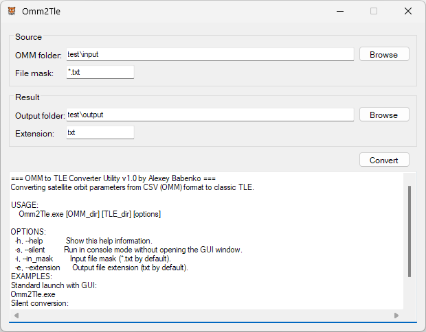

# Omm2Tle

A lightweight .NET Framework 4.7 utility designed to convert satellite orbit parameters from OMM format to classic TLE format :tiger:



### Key Features
* Works in both Graphical User Interface (GUI) and Command-Line Interface (CLI / Console) modes.

### How It Works

The utility scans the target directory for files matching the specified file mask and processes them as follows:
1. **Conversion**: If valid CSV/OMM data is detected, it converts the parameters into the classic TLE format.
2. **Output**: Converted files are saved to the destination folder using the specified file extension.
3. **Fallback Mechanism**: If a file cannot be converted (e.g., it is already in TLE format or contains plain text), the utility copies it to the destination folder **as-is**, changing only its extension. 

*This design ensures seamless processing for mixed folders containing both CSV/OMM and TLE text files without breaking the workflow.*

### Usage
To explore console mode options and parameters, run the following command:
```
Omm2Tle.exe --help
```

### Download
You can download the latest compiled binaries from the [Releases](https://github.com/GreenAlf/Omm2Tle/releases) page.


## Licensing

This project contains code and assets under different open-source licenses:

* **Source Code:** All original source code written for this project is licensed under the **MIT License**. See the `LICENSE` file for the full text.
* **Emoji Assets:** The emoji graphics included in this project are created by [OpenMoji](https://openmoji.org) and are licensed under the **Creative Commons Attribution-ShareAlike 4.0 International License (CC BY-SA 4.0)**.
* **Third-Party Libraries:** This project uses [CsvHelper](https://joshclose.github.io/CsvHelper/), which is dual-licensed, under the terms of the **Apache License 2.0**.

---

### MIT License (Summary)
Permission is hereby granted, free of charge, to any person obtaining a copy of this software and associated documentation files, to deal in the Software without restriction, including without limitation the rights to use, copy, modify, merge, publish, distribute, sublicense, and/or sell copies of the Software.
